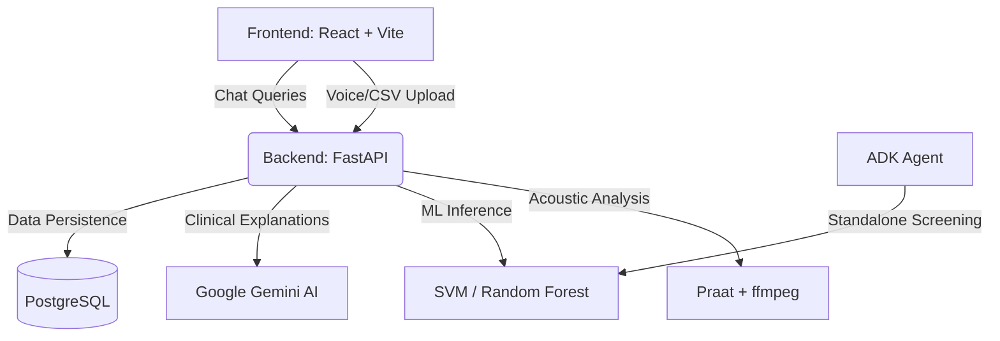

# Lucent — Parkinson's Disease Screening & Education Platform

## Problem
Parkinson’s Disease (PD) is a progressive nervous system disorder that affects movement. Early diagnosis is often challenging due to the subtle onset of symptoms. While voice changes, such as hypophonia (soft speech) and monotone voice, can be early indicators of PD, accessible and non-invasive screening tools are not widely available for the general public, often delaying early intervention.

## Solution
Lucent is a comprehensive educational and screening platform designed to raise awareness and provide an accessible, non-diagnostic screening tool for Parkinson's Disease. It leverages machine learning to analyze vocal acoustic biomarkers from brief voice recordings, providing users with a likelihood score and feature importances. The platform also features an interactive 3D brain explorer, a disease stage simulator, and an AI-powered clinical assistant to help users better understand the disease. 

## Architecture
The platform is composed of three main components:

1. **Frontend (`/frontend`)**: A React + TypeScript + Vite application. It provides an intuitive UI for voice screening, a personal dashboard for symptom tracking, and an interactive 3D brain explorer built with React Three Fiber.
2. **Backend (`/backend`)**: A FastAPI + PostgreSQL backend. It handles machine learning inference (SVM/Random Forest) on the UCI Parkinson's dataset, extracts real acoustic biomarkers using Praat, and leverages Google Gemini AI (`gemini-2.5-flash`) to generate structured, plain-English clinical explanations.
3. **Agent (`/parkinsons-detector`)**: A standalone Google ADK ReAct agent. It orchestrates dynamic ML models, runs physiological data guardrails, and maintains patient session history, demonstrating how the screening logic can be deployed as an autonomous agent.

### High-Level Architecture Diagram


## Instructions for Setup

### Prerequisites
- Node.js & npm
- Python 3 & `uv` (or pip)
- Docker (for PostgreSQL)
- `ffmpeg` (for audio conversion)
  - macOS: `brew install ffmpeg`
  - Linux: `sudo apt-get install ffmpeg`

### 1. Backend Setup
```bash
cd backend
# Start PostgreSQL via Docker
docker compose up -d

# Install dependencies
uv venv
source .venv/bin/activate  # Or .venv\Scripts\activate on Windows
uv pip install -e .

# Configure environment
cp .env.example .env
# Edit .env to add your GEMINI_API_KEY

# Run the server
uvicorn app.main:app --host 127.0.0.1 --port 8000 --reload
```

### 2. Frontend Setup
```bash
cd frontend
npm install
npm run dev
```
Visit `http://localhost:5173`. The frontend is pre-configured to point to the local backend at `http://127.0.0.1:8000`.

### 3. Agent Setup (Optional)
To test the standalone ADK agent:
```bash
cd parkinsons-detector
uvx google-agents-cli setup
agents-cli install
agents-cli playground
```

## Known Limitations
The underlying model is trained on the UCI Parkinson's voice dataset—195 recordings from just 32 subjects. The dataset has class imbalance and cross-validation is not grouped by subject. As such, the reported accuracy may be optimistic. **This is not a diagnostic tool.** The platform explicitly discloses this limitation to users on the About page.

---
*Note: Detailed documentation for each component can be found in their respective directories: [Frontend](frontend/README.md), [Backend](backend/README.md), and [Agent](parkinsons-detector/README.md).*
